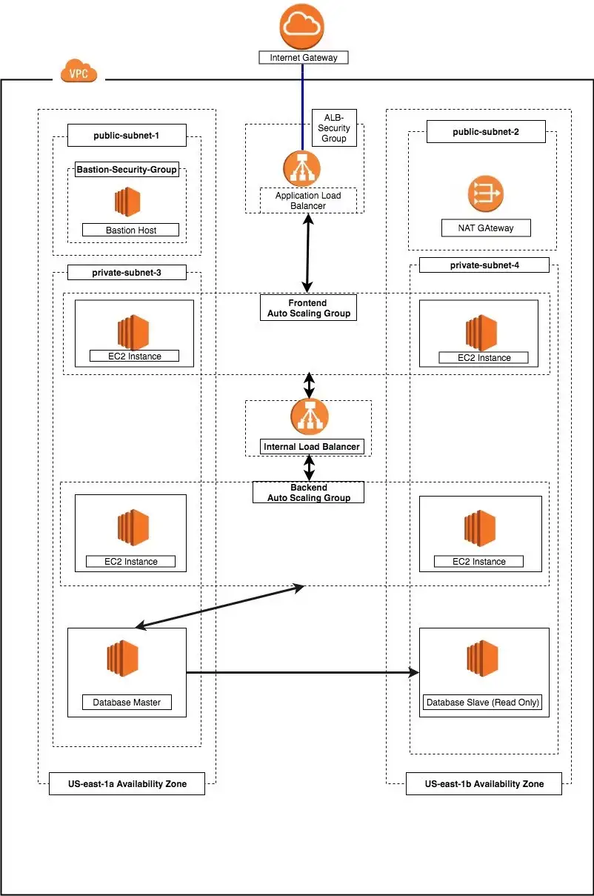

## Designing a Three-Tier Architecture in AWS.

#### A three-tier architecture is a software architecture pattern where the application is broken down into three logical tiers: the presentation layer, the business logic layer and the data storage layer. This architecture is used in a client-server application such as a web application that has the frontend, the backend and the database. Each of these layers or tiers does a specific task and can be managed independently of each other. This a shift from the monolithic way of building an application where the frontend, the backend and the database are both sitting in one place.

#### I'm using following AWS services to design and build a three-tier cloud infrastructure: Elastic Compute Cloud (EC2), Auto Scaling Group, Virtual Private Cloud(VPC), Elastic Load Balancer (ELB), Security Groups and the Internet Gateway. Our infrastructure will be designed to be highly available and fault tolerant.

