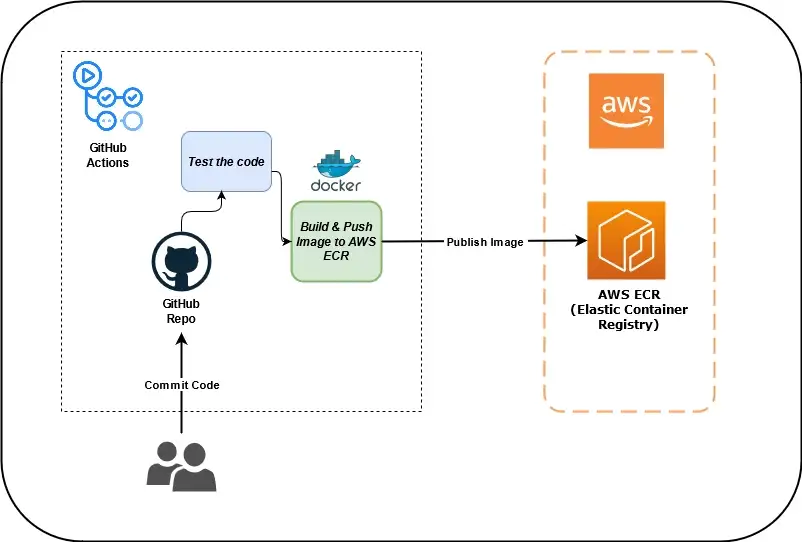
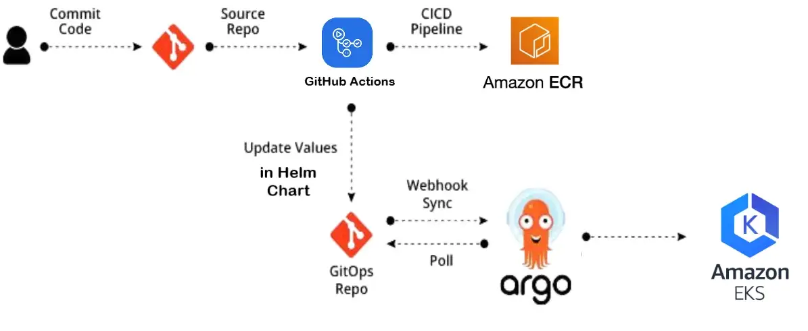
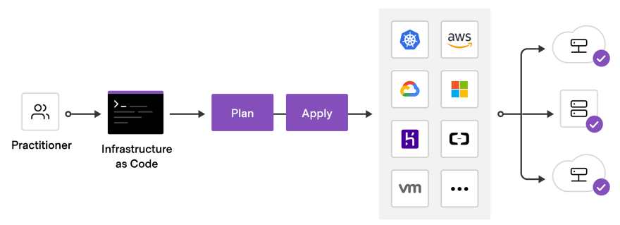

## Designing a Three-Tier Architecture in AWS.

#### A three-tier architecture is a software architecture pattern where the application is broken down into three logical tiers: the presentation layer, the business logic layer and the data storage layer. This architecture is used in a client-server application such as a web application that has the frontend, the backend and the database. Each of these layers or tiers does a specific task and can be managed independently of each other. This a shift from the monolithic way of building an application where the frontend, the backend and the database are both sitting in one place.

#### I'm using following AWS services to design and build a three-tier cloud infrastructure: Elastic Compute Cloud (EC2), Auto Scaling Group, Virtual Private Cloud(VPC), Elastic Load Balancer (ELB), Security Groups and the Internet Gateway. Our infrastructure will be designed to be highly available and fault tolerant.

-------------

## What are we solving for?

1. Modularity: The essence of having a three-tier architecture is to modularize our application such that each part can be managed independently of each other. With modularity, teams can focus on different tiers of the application and changes made as quickly as possible. Also, modularization helps us recover quickly from an unexpected disaster by focusing solely on the faulty part.

2. Scalability: Each tier of the architecture can scale horizontally to support the traffic and request demand coming to it. This can easily be done by adding more EC2 instances to each tier and load balancing across them. For instance, assuming we have two EC2 instances serving our backend application and each of the EC2 instances is working at 80% CPU utilization, we can easily scale the backend tier by adding more EC2 instances to it so that the load can be distributed. We can also automatically reduce the number of the EC2 instances when the load is less.

3. High Availability: With the traditional data centre, our application is sitting in one geographical location. If there is an earthquake, flooding or even power outage in that location where our application is hosted, our application will not be available. With AWS, we can design our infrastructure to be highly available by hosting our application in different locations known as the availability zones.

4. Fault Tolerant: We want our infrastructure to comfortably adapt to any unexpected change both to traffic and fault. This is usually done by adding a redundant system that will account for such a hike in traffic when it does occur. So instead of having two EC2 instances working at 50% each, such that when one instance goes bad, the other instance will be working at 100% capacity until a new instance is brought up by our Auto Scaling Group, we have extra instance making it three instances working at approximately 35% each. This is usually a tradeoff made against the cost of setting up a redundant system.

5. Security: We want to design an infrastructure that is highly secured and protected from the prying eyes of hackers. As much as possible, we want to avoid exposing our interactions within the application over the internet. This simply means that the application will communicate within themselves with a private IP. The presentation (frontend) tier of the infrastructure will be in a private subnet (the subnet with no public IP assigned to its instances) within the VPC. Users can only reach the frontend through the application load balancer. The backend and the database tier will also be in the private subnet because we do not want to expose them over the internet. We will set up the Bastion host for remote SSH and a NAT gateway for our private subnets to access the internet. The AWS security group helps us limit access to our infrastructure setup.

-------------

## CI/CD (It not refer to the architecture above, it will use for another use-case with modern approach)

1. For the CI, we can build & push docker images to AWS ECR (Elastic Container Registry) using GitHub Actions.

2. For the CD, From the above image, you can see I am using GitHub Actions to build Docker Image of the application and then push the image to a private ECR (Elastic Container Image) repository. And then update the version of the new image in the Helm Chart present in the Git repo. As soon as there is some change in the Helm Chart, ArgoCD detects it and starts rolling out and deploying the new Helm chart in the Kubernetes cluster. One key ingredient to enable GitOps is to have the CI separate from CD. Once CI execution is done, the artifact will be pushed to the repository and ArgoCD will be taking care of the CD. And the best part of this is everything will gonna be private.

## IaaC

Terraform is an infrastructure as code (IaC) tool that allows us to build, change, and version infrastructure safely and efficiently.

Terraform uses HashiCorp Language (HCL) as its language to define a resource regardless of the provider being used.

## Why terraform ?

Terraform allows DevOps Engineers to automate and manage the Data Center Infrastructure, the platforms, and the services that run on those platforms, all from one location, that you can reuse and share.

Instead of handling the infrastructure manually by logging into the AWS Web Console to create each component of your infrastructure, you just do it in code.

And if you need to change anything? Well then you just update the Terraform code and apply it, helping you to automate your cloud infrastructure and configuration.

When you think of infrastructure automation you normally think of provisioning, which means getting and setting the physical components required to run specific applications.

We achieve this by creating scripts or functions with a tool like Terraform, so that they can be reused to save us time and effort.

I have build some terraform code and store it in [here](https://github.com/AnhTran1610/Assignment/tree/master/problem2_code) for simulate the infrastructure need to be use that script in order to remove loose security group rule.
